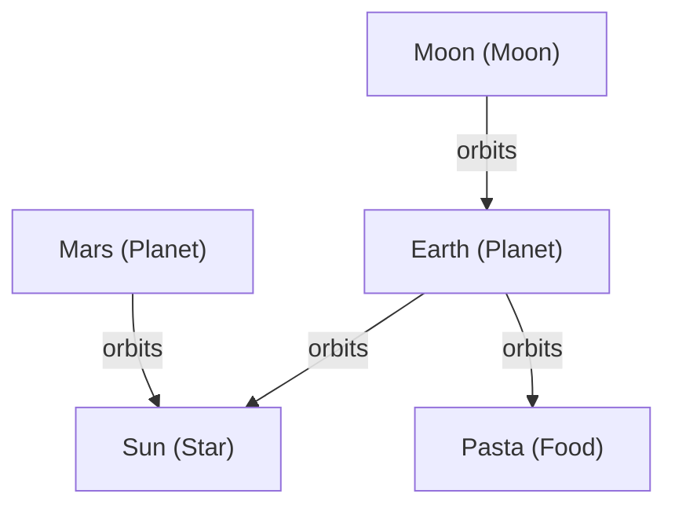

# Case Study: Ontology Validation and Graph Visualization

**Problem:** A knowledge graph about astronomy can silently accept nonsensical
data, like "Earth orbits Pasta", if there are no type-level constraints. Traditional
validation only checks structural integrity, not whether a relation makes sense
for the types it connects.

**CKS solution:** The new `type_hierarchy` and `relation_type` extensions allow
declaring a type taxonomy and restricting which relation types can connect which
object types. Combined with `visualize_graph`, `explain_diff`, and
`suggest_evolution`, LLMs can now build, validate, and debug a knowledge graph
with full type safety — and see the graph rendered as a Mermaid diagram directly
in the chat.

---

## Scenario

We built an astronomy knowledge graph with:

- Three celestial objects: Sun (Star), Earth (Planet), Moon (Moon)
- Three `TypeDefinition` objects declaring Planet, Moon, and Star as subtypes of
  CelestialBody
- A `TypeRule` for `orbits`, allowing only CelestialBody types as both source
  and target
- Two valid `orbits` relations: Earth→Sun, Moon→Earth

We then attempted to add a relation Earth→Pasta (type Food) — a clear ontology
violation. The system caught it, and we visualized the resulting graph to see
exactly where the violation occurred.

---

## Tools Used

- `validate_knowledge` with extensions `type_hierarchy` and `relation_type`
- `evolve_knowledge`
- `suggest_evolution` — proposed operations for adding a new planet
- `explain_diff` — natural-language summary of changes
- `visualize_graph` — Mermaid diagram of the final graph

---

## What Happened

### 1. Initial graph passed ontology validation

```
validate_knowledge(extensions=["type_hierarchy", "relation_type"])
→ valid: true, no diagnostics
```

All three objects were correctly typed as subtypes of CelestialBody, and both
`orbits` relations conformed to the declared `TypeRule`.

### 2. Ontology violation detected

After adding a new object `Pasta` (type Food) and a relation `Earth → orbits →
Pasta`, re-validation returned:

```
CKS-EXT-RELATION-TYPE: Relation 'rel-earth-pasta' of type 'orbits' has target
'pasta' of type 'Food', which is not one of the allowed target types
['Star', 'Planet'] (or a declared subtype).
```

The system correctly identified that Food is not a CelestialBody and flagged
the violation with a precise diagnostic.

### 3. AI-assisted evolution with `suggest_evolution`

When asked to "Add a new planet Mars that orbits the Sun", the tool returned
guidance on which objects and relations to create, along with a dry-run
validation. The suggested operations were then applied via `evolve_knowledge`.

### 4. Natural-language diff with `explain_diff`

Comparing the current state to the original base version produced:

> "Added 2 object(s): Mars (Planet), Pasta (Food). Added 2 relation(s)"

The tool correctly identified both the legitimate addition (Mars) and the
violating addition (Pasta), giving a complete picture of what changed.

### 5. Graph visualization with `visualize_graph`

The final graph was rendered as a Mermaid diagram directly in the chat:



The violating edge (Earth→Pasta) is clearly visible alongside the valid
relations, making it immediately obvious where the problem lies.

---

## Key Takeaways

- **Ontology constraints catch type errors that structural validation misses.**
  The system prevented a nonsense relation (Earth orbits Pasta) from being
  silently accepted.
- **Visualization makes debugging instant.** The Mermaid diagram shows the
  entire graph at a glance, with the violating edge clearly visible.
- **AI-assisted evolution reduces errors.** `suggest_evolution` proposed
  structurally valid operations for adding Mars, which passed validation on
  the first attempt.
- **Natural-language diffs complement machine-readable output.** `explain_diff`
  summarized the changes in a way that's easy for humans and LLMs to understand.
- **All checks are opt-in.** Extensions `type_hierarchy` and `relation_type` are
  activated only when explicitly requested, so existing workflows are unaffected.

---

## Reproduce It Yourself

1. Install `cks-mcp` (v1.9.0+) and connect it to Claude Desktop.
2. Start a chat and say:  
   `Use cks-mcp to create an astronomy graph with type definitions and a rule that only celestial bodies can orbit each other. Then try to make Earth orbit Pasta and validate with type_hierarchy and relation_type extensions.`
3. Observe the error: `CKS-EXT-RELATION-TYPE`.
4. Call `visualize_graph` to see the graph with the violating edge highlighted.

No coding required.
